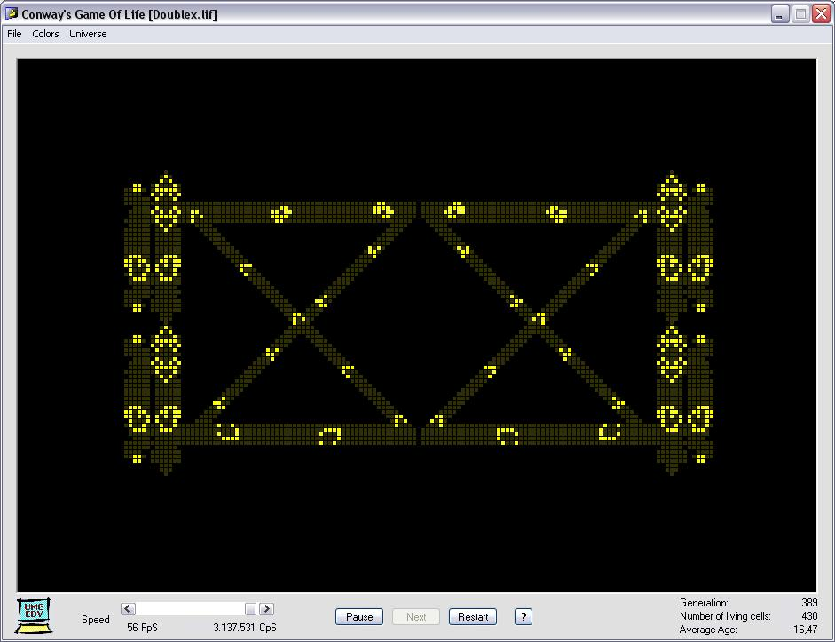



## Game Of Life

### Description

This is my implementation of Conway's Game of Life. Included is a folder with more than a hundred initial patterns found in the web, some of which have been adapted to fit in our wrap-around universe of 900 x 600 pixels (variable grid sizes of 90 x 60 to 450 x 300 cells) and produce quite interesting effects, machines, or perpetuum mobiles. Try it, download is 58 kB.
 
### More Info
 

             |
---                |---
**Submitted On**   |2008-03-18 14:57:10
**By**             |[ULLI](https://github.com/Planet-Source-Code/PSCIndex/blob/master/ByAuthor/ulli.md)
**Level**          |Intermediate
**User Rating**    |4.7 (14 globes from 3 users)
**Compatibility**  |VB 6\.0
**Category**       |[Games](https://github.com/Planet-Source-Code/PSCIndex/blob/master/ByCategory/games__1-38.md)
**World**          |[Visual Basic](https://github.com/Planet-Source-Code/PSCIndex/blob/master/ByWorld/visual-basic.md)
**Archive File**   |[Game\_Of\_Li210822412008\.zip](https://github.com/Planet-Source-Code/ulli-game-of-life__1-70358/archive/master.zip)

